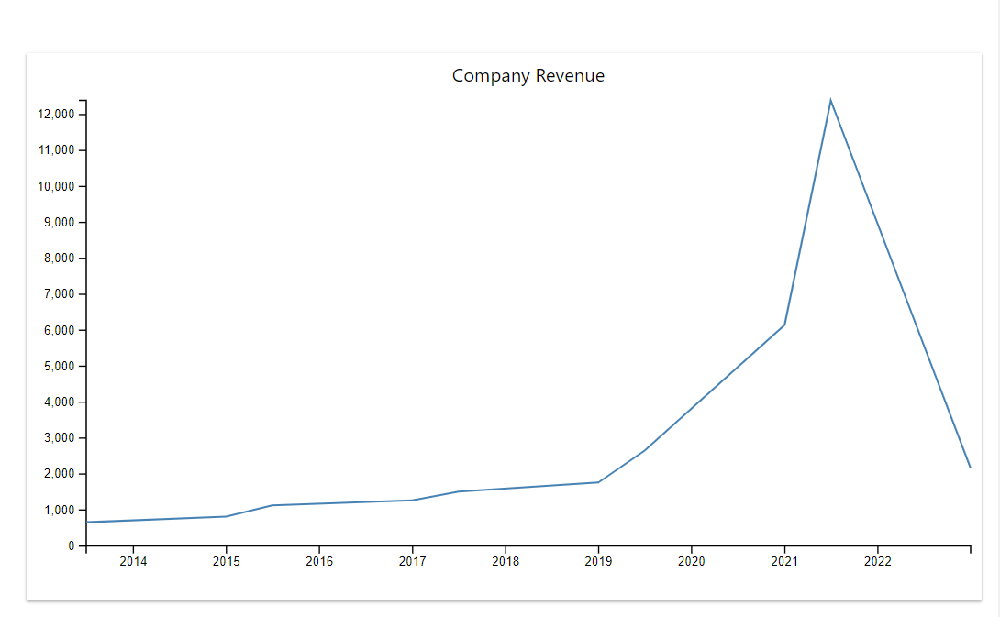
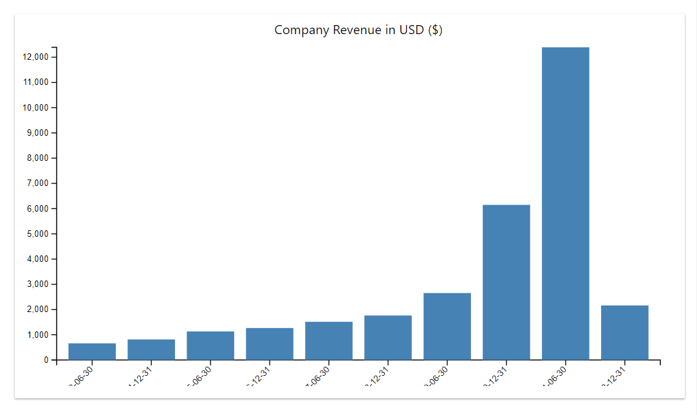
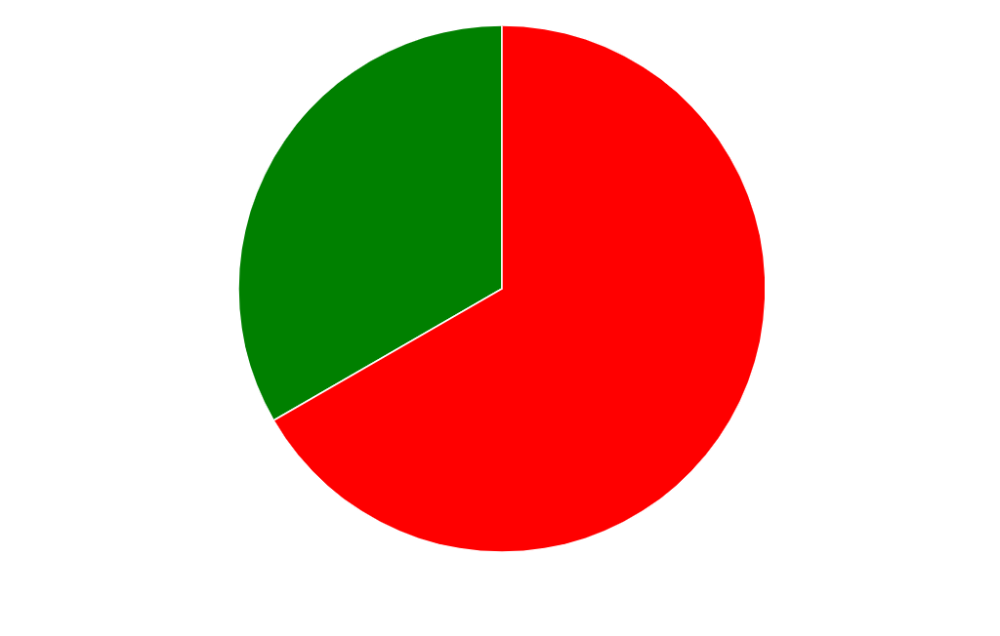

# D3.js graphs with popular front-end fameworks 

Many web applications and solutions are becoming more dynamic and responsive. This is, in part, due to high and scalable computing capacity. More web applications are deployed on various cloud platforms as a result of high reliability, availability and security.

To add to this, is the end users' continual demand for real time experience. As organizations becomes more data-driven, many are using data visualizations to either tell their stories or share real time feedback with their customers. Below are few chart samples:

## Line Chart

## Bar Chart

## Pie Chart

Check out this article [Getting started with D3.js and JavaScript](https://dev.to/callezenwaka/real-time-data-visualization-with-d3js-and-vuejs-4og3) to get started.